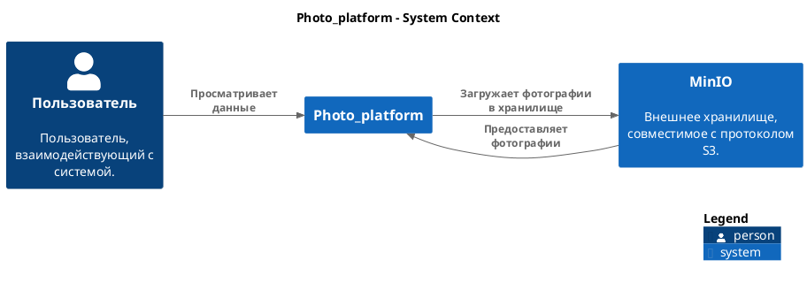

# TestSberTech
Тестовое задание для команды Сбертеха 

## Архитектура решения в нотации C4 

### Уровень системы

```plantuml
@startuml
set separator none
title Photo_platform - System Context

left to right direction

!include <C4/C4>
!include <C4/C4_Context>

Person(Пользователь, "Пользователь", $descr="Пользователь, взаимодействующий с системой.", $tags="", $link="")
System(MinIO, "MinIO", $descr="Внешнее хранилище, совместимое с протоколом S3.", $tags="", $link="")
System(Photo_platform, "Photo_platform", $descr="", $tags="", $link="")

Rel(MinIO, Photo_platform, "Предоставляет фотографии", $techn="", $tags="", $link="")
Rel(Photo_platform, MinIO, "Загружает фотографии в хранилище", $techn="", $tags="", $link="")
Rel(Пользователь, Photo_platform, "Просматривает данные", $techn="", $tags="", $link="")

SHOW_LEGEND(true)
@enduml
```
