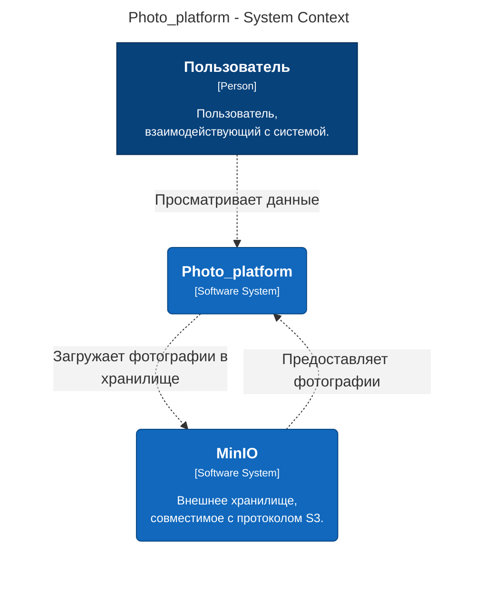
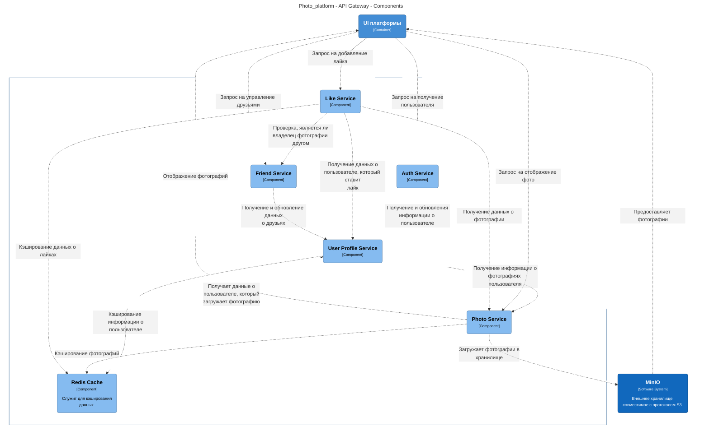
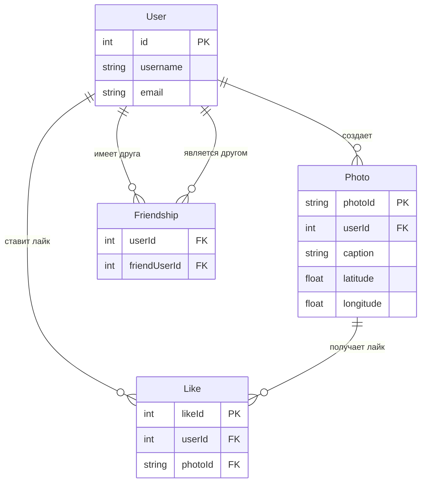

# TestSberTech

Тестовое задание для команды Сбертеха

## 1. Требования

### 1.1. Функциональные требования

#### 1.1.1. Авторизация и регистрация

**Регистрация пользователя:**

- Пользователь должен иметь возможность зарегистрироваться в системе, указав `username`, `email`, и `password`.
- Валидация данных при регистрации:
  - Длина `username` от 4 до 20 символов.
  - `email` должен быть в правильном формате.
  - `password` должен соответствовать требованиям безопасности (длина, сложность).
- После успешной регистрации пользователь получает подтверждение о создании аккаунта.

**Авторизация пользователя:**

- Пользователь должен иметь возможность авторизоваться по `username` и `password`.
- После успешной авторизации система должна возвращать токен доступа (JWT или другой), используемый для аутентификации в последующих запросах.

**Управление профилем пользователя:**

- Пользователь может обновить свой профиль (`username`, `email`).
- Изменение должно быть доступно через web-интерфейс.

#### 1.1.2. Каталог фотографий

**Загрузка фотографий:**

- Пользователь может загружать фотографии через web-интерфейс.
- Каждая фотография может сопровождаться текстовым описанием длиной до 1000 символов и геопозицией (широта и долгота).
- Система должна загружать фотографии в S3-совместимое хранилище (например, MinIO).

**Обновление и удаление фотографий:**

- Пользователь может редактировать описание и геопозицию фотографии.
- Пользователь может удалить фотографию.

**Просмотр фотографий:**

- Пользователь может просматривать список своих фотографий.
- Просмотр фото других пользователей возможен только для друзей.

#### 1.1.3. Лайки

**Ставить лайки фотографиям друзей:**

- Пользователь может ставить лайки на фотографии других пользователей, если они находятся в списке его друзей.

**Удаление лайков:**

- Пользователь может удалить лайк с фотографии.

**Просмотр лайков:**

- Пользователь может видеть, кто поставил лайк его фотографиям.

#### 1.1.4. Функционал друзей

**Добавление в друзья:**

- Пользователь может добавлять других пользователей в друзья.
- Добавление возможно только при согласии с обеих сторон.

**Удаление друзей:**

- Пользователь может удалять других пользователей из списка друзей.

**Просмотр списка друзей:**

- Пользователь может просматривать список своих друзей.

#### 1.1.5. Работа с геолокацией

**Добавление геопозиции к фотографии:**

- Пользователь может указать географическое местоположение при добавлении фотографии (широта и долгота).

**Фильтрация фотографий по геопозиции:**

- Система может позволять фильтровать фотографии по географическому положению, если это потребуется.

### 1.2. Нефункциональные требования

#### 1.2.1. Безопасность

**Шифрование паролей:**

- Пароли пользователей должны храниться в зашифрованном виде (использование алгоритмов хеширования, таких как bcrypt).

**Защита API:**

- Использование токенов (JWT) для аутентификации и авторизации запросов на backend.

**Межсервисная безопасность:**

- Взаимодействие между микросервисами должно быть защищено с использованием безопасных протоколов передачи данных (например, HTTPS).

**Валидация данных:**

- Все данные, вводимые пользователями, должны проходить проверку на корректность (валидацию) и фильтрацию для защиты от SQL-инъекций и XSS-атак.

#### 1.2.2. Производительность

**Скалируемость:**

- Приложение должно поддерживать горизонтальное масштабирование микросервисов для увеличения производительности (добавление новых узлов в кластер при увеличении нагрузки).

**Кеширование:**

- Использование кеширования (например, Redis) для повышения скорости работы при частых запросах, например, при просмотре фотографий или лайков.

**Оптимизация запросов к S3-хранилищу:**

- Ограничение объема передаваемых данных при работе с S3-хранилищем (например, использование миниатюр для фотографий при просмотре).

#### 1.2.3. Доступность

- Регулярное создание резервных копий для S3-хранилища и базы данных c переодичностью раз в сутки.

#### 1.2.4. Масштабируемость

**Микросервисная архитектура:**

- Разделение функционала на независимые микросервисы (например, микросервис авторизации, микросервис фотографий, микросервис лайков и микросервис друзей), которые могут масштабироваться независимо друг от друга.

**Автономность сервисов:**

- Микросервисы должны быть независимыми и иметь возможность обновляться или масштабироваться без необходимости останавливать другие компоненты системы.

#### 1.2.5. Интерфейс

- Интерфейс должен быть интуитивно понятным, с возможностью быстрого доступа к функциям добавления фотографий, управления профилем, работы с друзьями и лайками.

#### 1.2.6. Мониторинг и логирование

**Логирование:**

- Ведение логов работы системы для отслеживания проблем и их анализа.

**Мониторинг:**

- Система должна поддерживать мониторинг с метриками производительности, ошибки, времени ответа API и других параметров (использование инструментов вроде Prometheus, Grafana).

### 1.3. Системные требования

- Приложение должно быть развернуто на надежной серверной инфраструктуре с поддержкой контейнеризации
- Приложение должно использовать реляционную базу данных для хранения информации о пользователях, фотографиях и друзьях.
- Для хранения фотографий используется S3-совместимое хранилище.

### 1.4. Ожидаемые сценарии использования

**Регистрация пользователя:**

- Пользователь заходит на сайт, заполняет форму регистрации, создает учетную запись.

**Авторизация:**

- Пользователь вводит свои данные для входа и получает доступ к личному кабинету.

**Добавление фотографии:**

- Пользователь загружает фотографию, добавляет описание и геопозицию, после чего фотография сохраняется в хранилище.

**Управление друзьями:**

- Пользователь добавляет других пользователей в список друзей, чтобы иметь возможность лайкать их фотографии.

**Лайки фотографий друзей:**

- Пользователь заходит на страницу фотографии друга и ставит лайк.

---

## 2. Архитектура решения в нотации C4

#### Уровень системы



#### Уровень контейнеров

 ```mermaid
graph LR
  linkStyle default fill:#ffffff

  subgraph diagram ["Photo_platform - Containers"]
    style diagram fill:#ffffff,stroke:#ffffff

    1["<div style='font-weight: bold'>Пользователь</div><div style='font-size: 70%; margin-top: 0px'>[Person]</div><div style='font-size: 80%; margin-top:10px'>Пользователь,<br />взаимодействующий с системой.</div>"]
    style 1 fill:#08427b,stroke:#052e56,color:#ffffff
    16("<div style='font-weight: bold'>MinIO</div><div style='font-size: 70%; margin-top: 0px'>[Software System]</div><div style='font-size: 80%; margin-top:10px'>Внешнее хранилище,<br />совместимое с протоколом S3.</div>")
    style 16 fill:#1168bd,stroke:#0b4884,color:#ffffff

    subgraph 2 ["Photo_platform"]
      style 2 fill:#ffffff,stroke:#0b4884,color:#0b4884

      14("<div style='font-weight: bold'>База данных</div><div style='font-size: 70%; margin-top: 0px'>[Container]</div>")
      style 14 fill:#438dd5,stroke:#2e6295,color:#ffffff
      3("<div style='font-weight: bold'>UI платформы</div><div style='font-size: 70%; margin-top: 0px'>[Container]</div>")
      style 3 fill:#438dd5,stroke:#2e6295,color:#ffffff
      6("<div style='font-weight: bold'>API Gateway</div><div style='font-size: 70%; margin-top: 0px'>[Container]</div>")
      style 6 fill:#438dd5,stroke:#2e6295,color:#ffffff
    end

    3-. "<div>Передает данные</div><div style='font-size: 70%'></div>" .->6
    6-. "<div>Сохраняет данные индексации</div><div style='font-size: 70%'></div>" .->14
    16-. "<div>Предоставляет фотографии</div><div style='font-size: 70%'></div>" .->3
    6-. "<div>Отображение фотографий</div><div style='font-size: 70%'></div>" .->3
    6-. "<div>Загружает фотографии в<br />хранилище</div><div style='font-size: 70%'></div>" .->16
    1-. "<div>Просматривает данные</div><div style='font-size: 70%'></div>" .->3
  end
```

#### Компонентный уровень



## 3. ER-диаграмма



## 3. Макеты 

