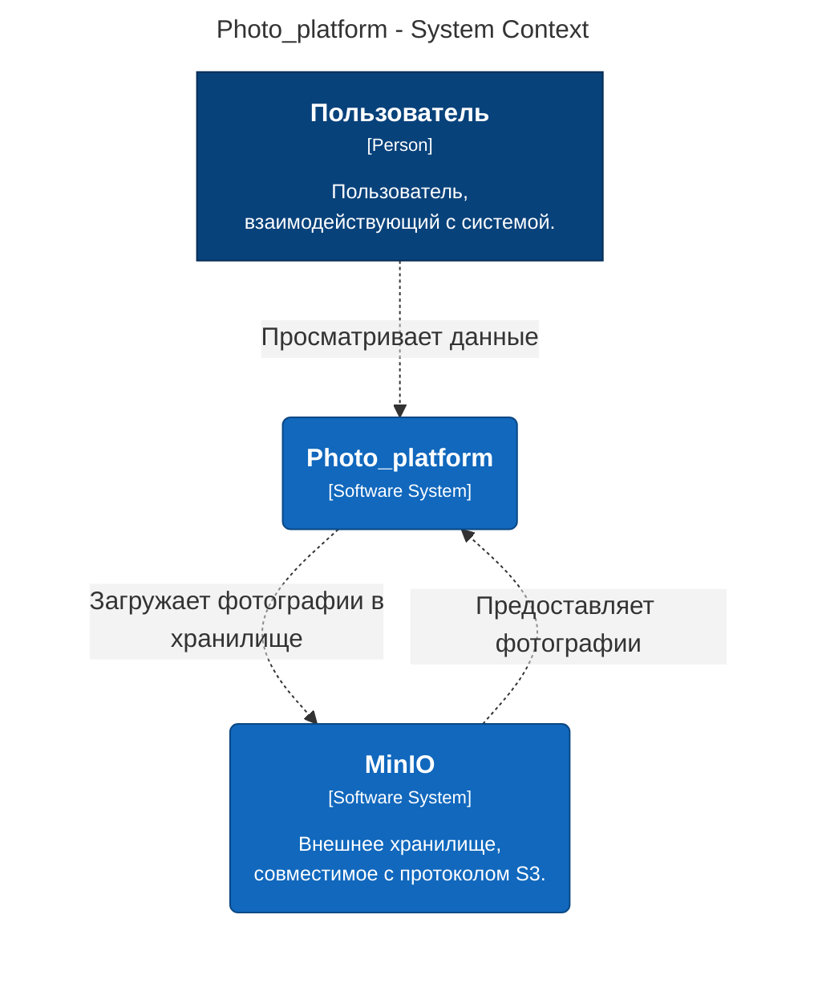
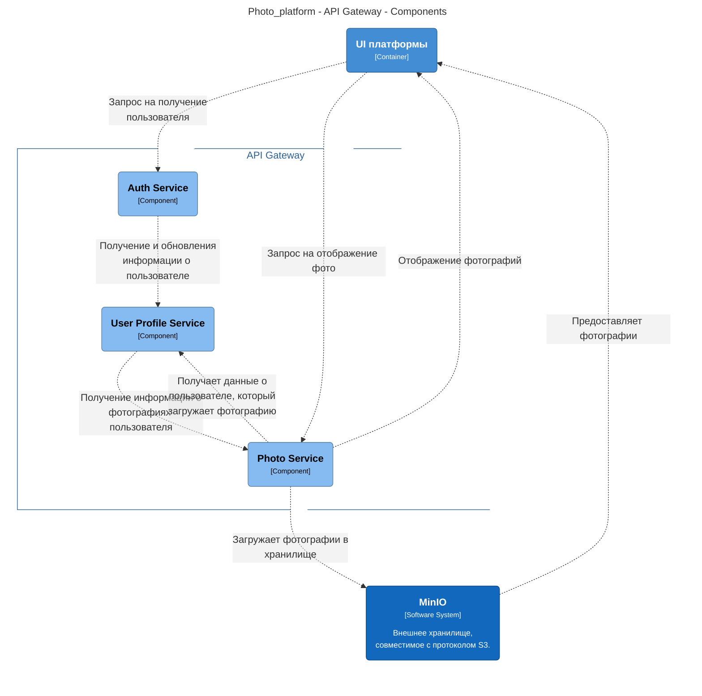

# TestSberTech
Тестовое задание для команды Сбертеха 


## Архитектура решения в нотации C4 

#### Уровень системы


#### Уровень контейнеров 
 ```mermaid
graph LR
  linkStyle default fill:#ffffff

  subgraph diagram ["Photo_platform - Containers"]
    style diagram fill:#ffffff,stroke:#ffffff

    1["<div style='font-weight: bold'>Пользователь</div><div style='font-size: 70%; margin-top: 0px'>[Person]</div><div style='font-size: 80%; margin-top:10px'>Пользователь,<br />взаимодействующий с системой.</div>"]
    style 1 fill:#08427b,stroke:#052e56,color:#ffffff
    13("<div style='font-weight: bold'>MinIO</div><div style='font-size: 70%; margin-top: 0px'>[Software System]</div><div style='font-size: 80%; margin-top:10px'>Внешнее хранилище,<br />совместимое с протоколом S3.</div>")
    style 13 fill:#1168bd,stroke:#0b4884,color:#ffffff

    subgraph 2 ["Photo_platform"]
      style 2 fill:#ffffff,stroke:#0b4884,color:#0b4884

      11("<div style='font-weight: bold'>База данных</div><div style='font-size: 70%; margin-top: 0px'>[Container]</div>")
      style 11 fill:#438dd5,stroke:#2e6295,color:#ffffff
      3("<div style='font-weight: bold'>UI платформы</div><div style='font-size: 70%; margin-top: 0px'>[Container]</div>")
      style 3 fill:#438dd5,stroke:#2e6295,color:#ffffff
      6("<div style='font-weight: bold'>API Gateway</div><div style='font-size: 70%; margin-top: 0px'>[Container]</div>")
      style 6 fill:#438dd5,stroke:#2e6295,color:#ffffff
    end

    3-. "<div>Передает данные</div><div style='font-size: 70%'></div>" .->6
    6-. "<div>Сохраняет данные индексации</div><div style='font-size: 70%'></div>" .->11
    13-. "<div>Предоставляет фотографии</div><div style='font-size: 70%'></div>" .->3
    6-. "<div>Отображение фотографий</div><div style='font-size: 70%'></div>" .->3
    6-. "<div>Загружает фотографии в<br />хранилище</div><div style='font-size: 70%'></div>" .->13
    1-. "<div>Просматривает данные</div><div style='font-size: 70%'></div>" .->3
  end
```

#### Компонентный уровень

